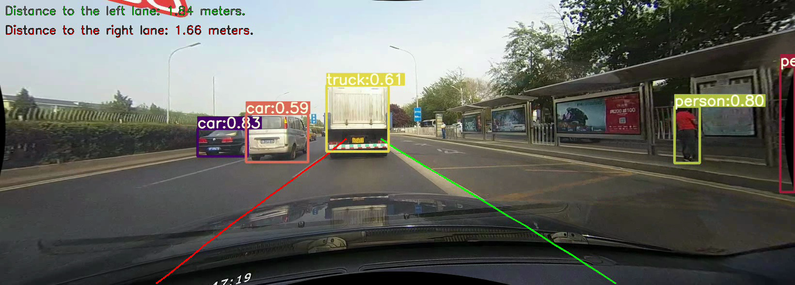

<p align="center">
  <a href="" rel="noopener">
 </a>
</p>
<<<<<<< HEAD


<h3 align="center">SELF DRIVING</h3>

<div align="center">

[]()
[](https://github.com/kylelobo/The-Documentation-Compendium/issues)
[](https://github.com/kylelobo/The-Documentation-Compendium/pulls)
[](/LICENSE)

</div>


<<<<<<< HEAD
# Self-Driving Assistance System

This project is focused on creating a **real-time driver assistance system** using advanced deep learning techniques. The system is designed to enhance road safety by detecting lanes, monitoring deviations, and identifying various road objects.

---

## **Features**

### **1. Lane Detection and Deviation Warning**
- **Purpose:** Identify the current driving lane boundaries in real time and calculate the vehicle's distance from the left and right lane edges.
- **Goal:** Alert the driver when the vehicle deviates from its lane, improving safety.
- **Dataset:** Trained on the **CULane dataset**, ensuring robust performance in diverse driving conditions.

### **2. Object Detection and Classification**
- **Purpose:** Detect and classify road objects to improve situational awareness:
  - **Vehicles:** Cars, buses, trucks, motorcycles, bicycles.
  - **Pedestrians:** Recognize and track people on the road.
  - **Traffic Signs:** Detect and identify traffic lights and stop signs.
- **Technology:** The object detection model is based on **YOLOv5**, with weights converted to TensorRT (TRT) for optimized performance on the NVIDIA Jetson Nano.

---

## **Technologies and Tools**
### CUDA 
- **Frameworks:** YOLOv5, TensorRT, NVIDIA DeepStream, ONNX.
- **Dataset:**
  - **Lane Detection:** CULane dataset.
  - **Object Detection:** Custom dataset fine-tuned on YOLOv5.
- **Hardware:** Optimized for NVIDIA Jetson Nano to enable edge computing.

---


## Howto

### Download ONNX Model

Clone PINTO_model_zoo repository and download Ultra-Fast-Lane-Detection
 model.
```
git clone https://github.com/PINTO0309/PINTO_model_zoo.git
cd PINTO_model_zoo/140_Ultra-Fast-Lane-Detection/
./download.sh
```
Check `trtexec`
```
/usr/src/tensorrt/bin/trtexec --onnx=./saved_model_culane/ultra_falst_lane_detection_culane_288x800.onnx

or

/usr/src/tensorrt/bin/trtexec --onnx=./saved_model_tusimple/ultra_falst_lane_detection_tusimple_288x800.onnx
=======


# Self-Driving Assistance System

This project is focused on creating a **real-time driver assistance system** using advanced deep learning techniques. The system is designed to enhance road safety by detecting lanes, monitoring deviations, and identifying various road objects.

---

## **Features**

### **1. Lane Detection and Deviation Warning**
- **Purpose:** Identify the current driving lane boundaries in real time and calculate the vehicle's distance from the left and right lane edges.
- **Goal:** Alert the driver when the vehicle deviates from its lane, improving safety.
- **Dataset:** Trained on the **CULane dataset**, ensuring robust performance in diverse driving conditions.

### **2. Object Detection and Classification**
- **Purpose:** Detect and classify road objects to improve situational awareness:
  - **Vehicles:** Cars, buses, trucks, motorcycles, bicycles.
  - **Pedestrians:** Recognize and track people on the road.
  - **Traffic Signs:** Detect and identify traffic lights and stop signs.
- **Technology:** The object detection model is based on **YOLOv5**, with weights converted to TensorRT (TRT) for optimized performance on the NVIDIA Jetson Nano.

---

## **Technologies and Tools**
### CUDA 
- **Frameworks:** YOLOv5, TensorRT, NVIDIA DeepStream, ONNX.
- **Dataset:**
  - **Lane Detection:** CULane dataset.
  - **Object Detection:** Custom dataset fine-tuned on YOLOv5.
- **Hardware:** Optimized for NVIDIA Jetson Nano to enable edge computing.

---


## Howto

### Download ONNX Model

Clone PINTO_model_zoo repository and download Ultra-Fast-Lane-Detection
 model.
```
git clone https://github.com/PINTO0309/PINTO_model_zoo.git
cd PINTO_model_zoo/140_Ultra-Fast-Lane-Detection/
./download.sh
```
Check `trtexec`
>>>>>>> be89415c5e5c7104d95351c8c52b9aa8519811e0
```
/usr/src/tensorrt/bin/trtexec --onnx=./saved_model_culane/ultra_falst_lane_detection_culane_288x800.onnx

<<<<<<< HEAD
=======
or

/usr/src/tensorrt/bin/trtexec --onnx=./saved_model_tusimple/ultra_falst_lane_detection_tusimple_288x800.onnx
```

>>>>>>> be89415c5e5c7104d95351c8c52b9aa8519811e0
### Convert ONNX Model to TensorRT Serialize engine file.

### Run 
```
python3 main.py \
    --model ultra_falst_lane_detection_culane_288x800.trt
    --model_config culane --videopath ... --output test.mp4

```


## TEST


